# What data structure?

They are mechanisms for organizing data that respond to all types of processing and organization, but in addition to storage, they are responsible for applying insertion and removal methods along with auxiliary applications that help with code manipulation.

This is a small basic document of my studies of data structures (stack, queue and list) that I intend to bring forward new applications and codes.

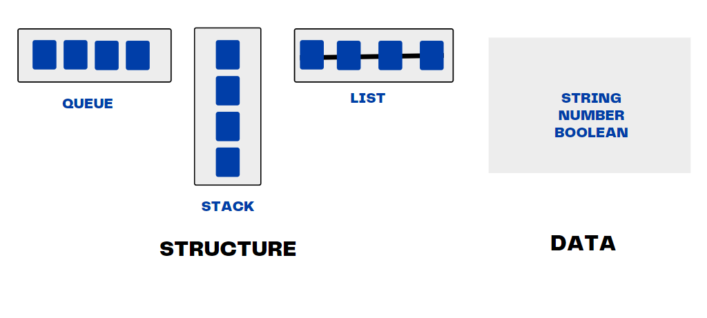

# Stack Data Structure

The Stack data structure is based on the **LIFO (Last In First Out)** concept.

In the example below the Stack structure is going through initial push insertion method and then pop removal method. ! It is important to mention that Stack follows the architecture of `TOP` and `BASE`

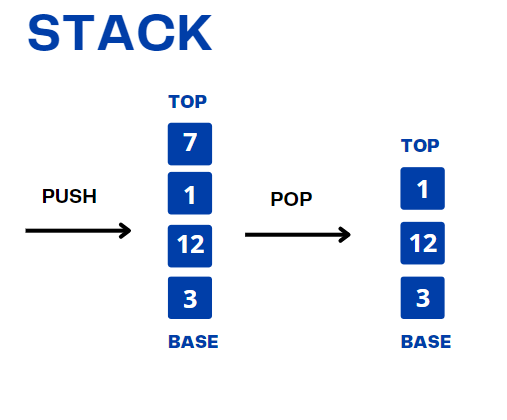

## What is the difference between Stack and Array?

At the beginning of the studies on structure I had a big doubt why it would be more advantageous to use Stack than Array:

### Stack

In addition to the advantages presented below Stack works with addition, removal, storage of data together with auxiliary methods.

• Can contain elements of different types.

• Has no fixed size.

• Important in memory flexibility.

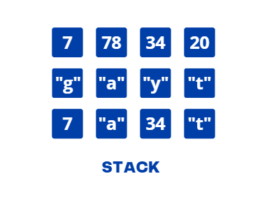

### Array
 
Array is also advantageous depending on the problem to be executed, but with structures it is possible to have greater freedom in data manipulation.

• Contains elements of the same type.

• Fixed size.

• Not flexible in memory.

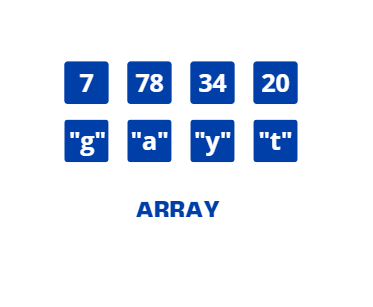

# How Stack works encoding?

This is a basic insertion system that contains indices [0, 1, 2, 3] with the architecture of `TOP` and `BASE`.

Below, I present how the Stack behind the system is formed and then the encoding: a constant that instantiates book and presents the removal and addition methods based on the **LIFO (Last In First Out)**.

!! Remembering that each `push: insertion and pop: removal`.

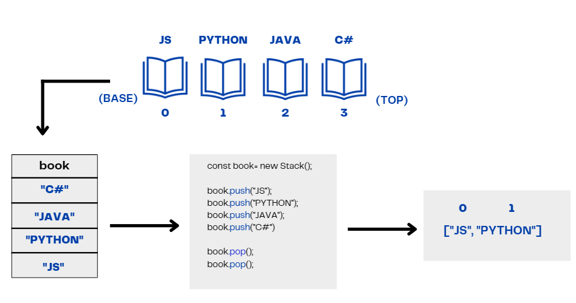

## Methods and their importance!

As mentioned above, the Stack works with addition, removal, storage and `helper methods` methods that help in data processing:

• push: This method removes elements in the structure.
• pop: This method adds elements to the structure.
 
 
// helper methods
 
 
• isEmpty: This method returns true if the structure contains no elements and false if it is greater than zero.
 
 
• peek: This method returns the element that is on top.
 
 
• size: This method returns the number of elements in the structure.
 
 
• toString: This method transforms the element into a string.

! references: 
- https://www.simplilearn.com/tutorials/data-structure-tutorial/stacks-in-data-structures#:~:text=The%20stack%20data%20structure%20is,of%20money%2C%20and%20many%20more.

- https://www.programiz.com/javascript/examples/stack#:~:text=The%20stack%20is%20a%20data,put%20at%20last%20comes%20first.

- https://www.amazon.com.br/Estruturas-Dados-Algoritmos-Com-Javascript/dp/8575226932/ref=asc_df_8575226932/?tag=googleshopp00-20&linkCode=df0&hvadid=379765802639&hvpos=&hvnetw=g&hvrand=556458599051375619&hvpone=&hvptwo=&hvqmt=&hvdev=c&hvdvcmdl=&hvlocint=&hvlocphy=1031720&hvtargid=pla-811121404201&psc=1

# Queue Data Structure

The Queue data structure is **FIFO (First In, First Out)** based. The Queue structure follows the same pattern as the Stack, but with some differences.

The **HTTP protocol (Hypertext Transfer Protocol)** is an example of a Queue, as a response is expected for each request sent by the client to the server. The chunks of message submissions are divided into a queued `chunk` series.

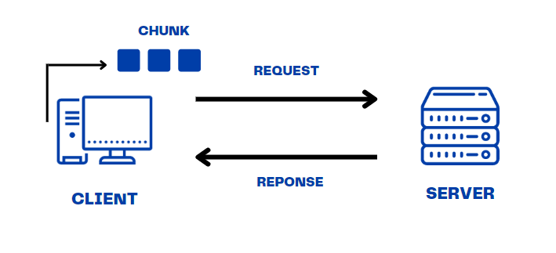

Queues follow the architecture of `Front` and `Back`, and are also represented by methods like all structures. Different from Stack a Queue follows the concept of **FIFO (First In, First Out)** allowing data insertion both on the back and front.

- Dequeue: Inserting data into the `Front` and `Back` part.

- Enqueue: Inserting data in the `Back` part only.

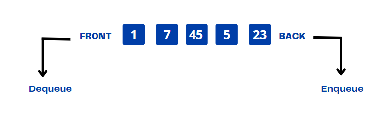

# How Queue works encoding?

The Queue also follows methods of adding, removing, storing and `helper methods`, an example used and you have already gone through this, possibly a large Queue, whether in the market, box office, among others, technology has greatly facilitated the reduction of Queues in person, but it is not something hard to find on a daily basis.
 
In the example below we have a Queue in a "ticket office" that follows the pattern of index and name of each person allocated and after following the cashier it decreases by 1 in 1. As the structures there are types of Queues preferred for example and non-preferred.

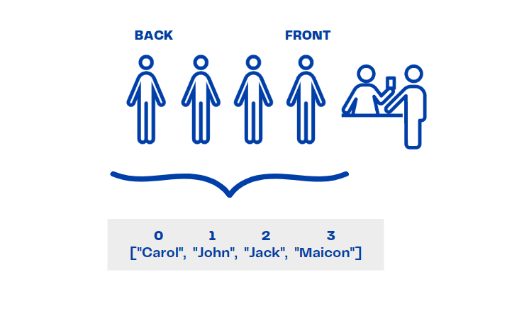

## Change insertion and removal

Assuming that “John” decides to give up his seat to an elderly person and “Maicon” to a wheelchair user, the entire Queue would have an offset both in the front and in the rear changing significantly.

So, for example, a system change can also be a method that allows the insertion and removal of an action where each action can be allowed.
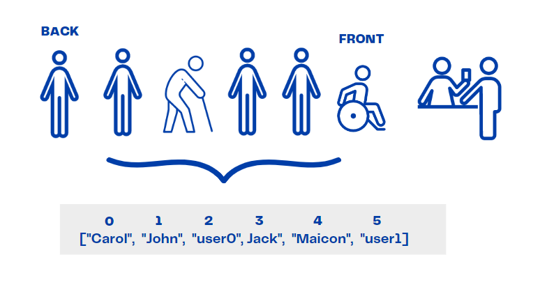

! references:

- https://logicmojo.com/data-structures-queue

-  https://www.studytonight.com/data-structures/queue-data-structure

- https://www.amazon.com.br/Estruturas-Dados-Algoritmos-Com-Javascript/dp/8575226932/ref=asc_df_8575226932/?tag=googleshopp00-20&linkCode=df0&hvadid=379765802639&hvpos=&hvnetw=g&hvrand=556458599051375619&hvpone=&hvptwo=&hvqmt=&hvdev=c&hvdvcmdl=&hvlocint=&hvlocphy=1031720&hvtargid=pla-811121404201&psc=1

# Memory Allocation

Before presenting about **List Structure** it is important to mention about memory allocation a process to
request execution of the program in the computation and there are two types.
 
But why is leasing important? We need to understand that this type of application not only in coding
occupies a space and the way of processing is very important in the performance of the software.
 
- Static allocation: Space already predefined in memory in the compilation process.
 
- Dynamic allocation: Memory space already reserved during execution.

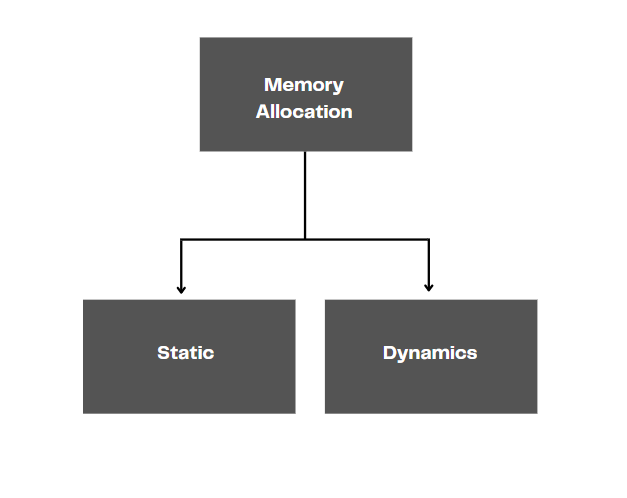

# List Data Structure

The list consists of **sequential sets** n > 0 nodes L1, L2, L3 ... Ln
 
List unlike other structures it has the **Node**: a structure that stores information to be managed by a list.
 
- Does not use indexes or position.
 
- Pointers indicate the next node.

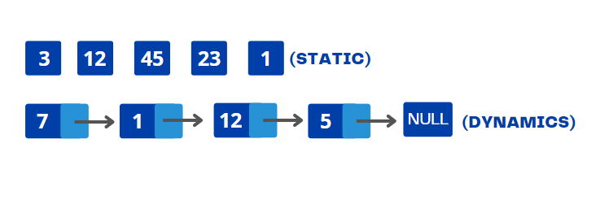

# Linked List

The advantageous use of the linked list in relation to the sequential list is in the properties of removal, addition becoming faster in execution, besides containing nodes that refer to other data.

- In addition to the linked list, there is a doubly linked list that has two pointers, one to the next node and one to the previous node.

# Event Loop

The previous examples were based on code, but I feel it's interesting when in addition to coding we can understand how things work under the hood.
 
The `Event Loop` is a repetition mechanism that executes events in a queued way bringing this subject to the `Node.js` that stands out, because it executes in a multithreaded way, different from other languages ​​that are single threading. `Javascript` executes a line of code procedurally, `sync/async` code is important to understand how each application works.
 
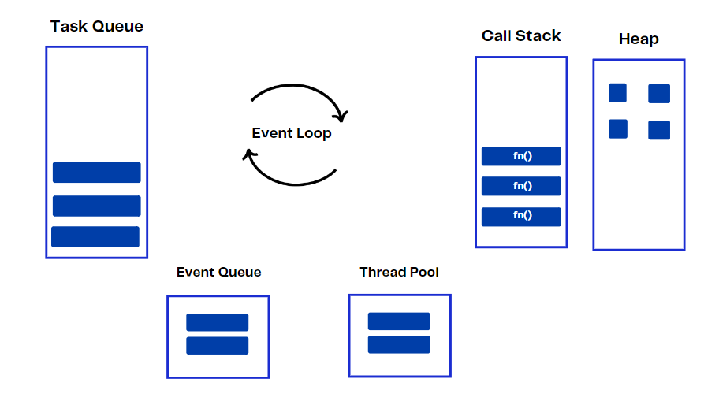

! This article is a great reference to the subject: https://levelup.gitconnected.com/demystifying-asynchronous-javascript-event-loop-call-stack-task-queue-and-more-51fb748a4bd4